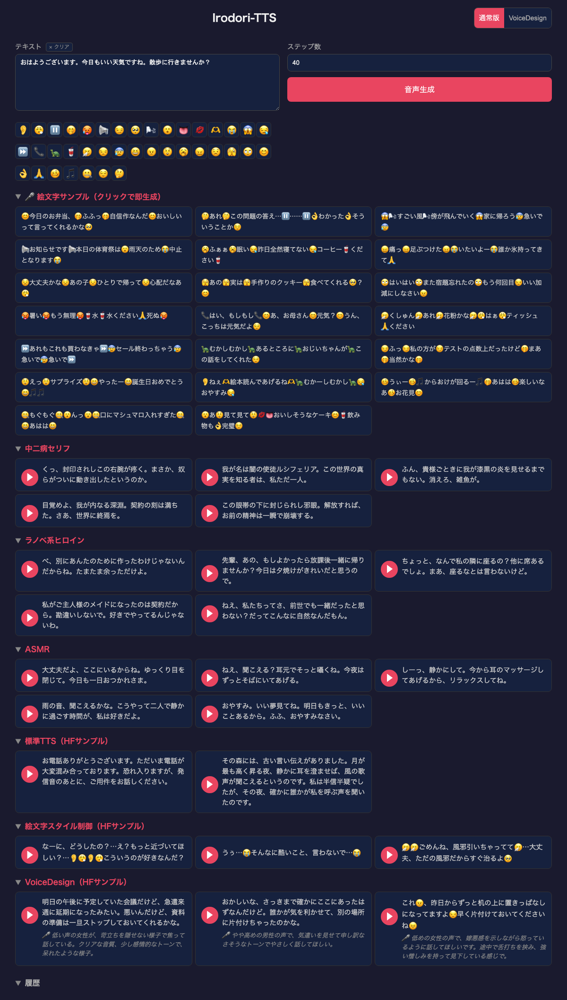

# Irodori-TTS Playground



Docker Compose で [Irodori-TTS](https://github.com/Aratako/Irodori-TTS) の**通常版**と **VoiceDesign版**を同時に起動し、ブラウザから手軽に音声合成を試せる Web UI です。

## Features

- **通常版 / VoiceDesign 切り替え** - UI 上のトグルで即座にモデルを切り替え
- **VoiceDesign キャプション** - テキストで声質を自由にデザイン（例: 「低い声の女性が優しく話す」「ロボットの声」）
- **絵文字パレット** - Irodori-TTS 対応の全39種絵文字をワンクリックでテキストに挿入
- **絵文字サンプル即生成** - 20種のサンプルテキストをクリックするだけで即座に音声生成
- **プリセット音声** - 中二病・ラノベヒロイン・ASMR・HFサンプルなど事前生成済み音声を試聴
- **セクション折りたたみ** - localStorage でトグル状態を永続化
- **キーボードショートカット** - `Cmd+Enter` / `Ctrl+Enter` で音声生成

## Requirements

- NVIDIA GPU (RTX 3090 24GB で動作確認済み)
- Docker / Docker Compose
- NVIDIA Container Toolkit

## Quick Start

```bash
git clone https://github.com/kazuph/Irodori-TTS-Playground.git
cd Irodori-TTS-Playground

# 起動（初回はモデルDL + Dockerビルドで時間がかかります）
docker compose up -d

# ブラウザで開く
open http://localhost:8080
```

## Architecture

```
┌─────────────────────────────────────────────┐
│                nginx (:8080)                │
│   /api/irodori/  → irodori-tts (:8005)      │
│   /api/voicedesign/ → voicedesign (:8006)   │
│   /             → Web UI (index.html)       │
└─────────────────────────────────────────────┘
       │                        │
┌──────┴──────┐        ┌───────┴───────┐
│ irodori-tts │        │  voicedesign  │
│ (通常版)    │        │ (VoiceDesign) │
│ :8005       │        │ :8006         │
│ ~4.8GB VRAM │        │ ~4.7GB VRAM   │
└─────────────┘        └───────────────┘
         GPU (shared, ~9.5GB total)
```

## Models

| Model | HuggingFace | VRAM | Description |
|-------|------------|------|-------------|
| Irodori-TTS-500M-v2 | [Aratako/Irodori-TTS-500M-v2](https://huggingface.co/Aratako/Irodori-TTS-500M-v2) | ~4.8GB | 通常版。リファレンス音声 or ランダム生成 |
| Irodori-TTS-500M-v2-VoiceDesign | [Aratako/Irodori-TTS-500M-v2-VoiceDesign](https://huggingface.co/Aratako/Irodori-TTS-500M-v2-VoiceDesign) | ~4.7GB | テキストキャプションで声質をデザイン |

両モデル合計で約9.5GB。RTX 3090 (24GB) で余裕をもって同時稼働できます。

## Benchmark (RTX 3090, bf16, 40 steps)

| Model | Length | Sample Text | Gen Time | Audio | RTF |
|-------|--------|------------|----------|-------|-----|
| Normal | Short (18字) | "おはようございます。今日もいい天気ですね。" | 1.43s | 4.00s | 2.81x |
| Normal | Medium (87字) | "その森には、古い言い伝えがありました。月が最も高く昇る夜、静かに耳を澄ませば、風の歌声が聞こえるというのです。私は半信半疑でしたが、その夜、確かに誰かが私を呼ぶ声を聞いたのです。" | 1.48s | 26.80s | 18.43x |
| Normal | Long (176字) | "昔々あるところに、おじいさんとおばあさんが住んでいました。おじいさんは山へ芝刈りに、おばあさんは川へ洗濯に行きました。おばあさんが川で洗濯をしていると、どんぶらこどんぶらこと大きな桃が流れてきました。おばあさんはその桃を拾って家に持ち帰り、おじいさんと一緒に桃を割ると、中から元気な男の子が生まれました。二人は大変喜んで、その子を桃太郎と名付けました。" | 1.54s | 30.00s | 19.75x |
| VoiceDesign | Short (18字) | "おはようございます。今日もいい天気ですね。" | 1.51s | 4.68s | 3.12x |
| VoiceDesign | Medium (87字) | "その森には、古い言い伝えがありました。月が最も高く昇る夜、静かに耳を澄ませば、風の歌声が聞こえるというのです。私は半信半疑でしたが、その夜、確かに誰かが私を呼ぶ声を聞いたのです。" | 1.49s | 25.72s | 17.47x |
| VoiceDesign | Long (176字) | "昔々あるところに、おじいさんとおばあさんが住んでいました。おじいさんは山へ芝刈りに、おばあさんは川へ洗濯に行きました。おばあさんが川で洗濯をしていると、どんぶらこどんぶらこと大きな桃が流れてきました。おばあさんはその桃を拾って家に持ち帰り、おじいさんと一緒に桃を割ると、中から元気な男の子が生まれました。二人は大変喜んで、その子を桃太郎と名付けました。" | 1.52s | 29.96s | 20.08x |

- **RTF** (Real-Time Factor) = Audio Duration / Generation Time（高いほど高速。1.0x = リアルタイム）
- 長文ほど RTF が大幅に向上（短文 ~3x → 中文 ~18x → 長文 ~20x）
- 生成時間はテキスト長にほぼ依存せず約1.5秒で安定
- VoiceDesign のキャプション処理によるオーバーヘッドはほぼゼロ

### VRAM Usage

| Configuration | VRAM |
|--------------|------|
| Normal model only | 4,840 MiB |
| VoiceDesign model only | 4,736 MiB |
| Both models (simultaneous) | 9,576 MiB / 24,576 MiB (39%) |

## API

### POST /api/irodori/v1/tts (通常版)

```bash
curl -X POST http://localhost:8080/api/irodori/v1/tts \
  -H "Content-Type: application/json" \
  -d '{"text":"こんにちは","num_steps":40}' \
  -o output.wav
```

### POST /api/voicedesign/v1/tts (VoiceDesign版)

```bash
curl -X POST http://localhost:8080/api/voicedesign/v1/tts \
  -H "Content-Type: application/json" \
  -d '{"text":"こんにちは","caption":"明るく元気な若い女性の声","num_steps":40}' \
  -o output.wav
```

## Credits

This project wraps the excellent [Irodori-TTS](https://github.com/Aratako/Irodori-TTS) by [Aratako](https://github.com/Aratako).

## License

MIT
